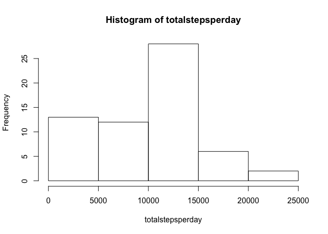
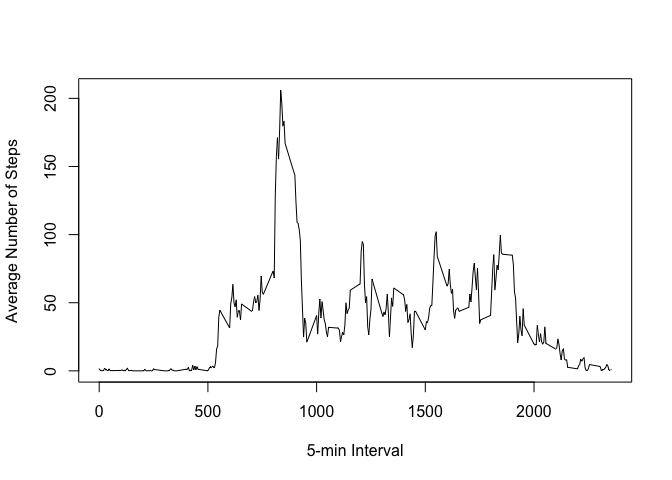
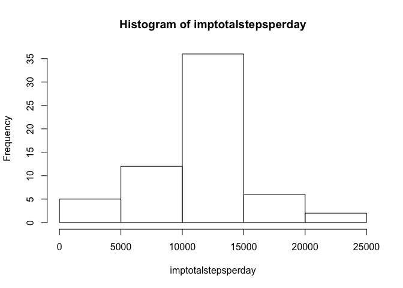
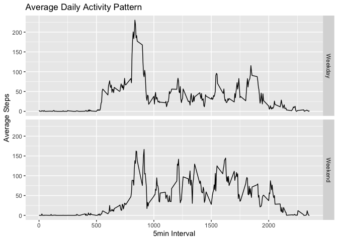

## Loading and preprocessing the data

```r
if (!file.exists("activity.csv")) { 
        unzip("activity.zip")}
dat <- read.csv("activity.csv", )
```

## What is mean total number of steps taken per day?
Total steps per day:

```r
totalstepsperday <- tapply(dat$steps, dat$date, sum, na.rm = TRUE)
totalstepsperday
```

```
## 2012-10-01 2012-10-02 2012-10-03 2012-10-04 2012-10-05 2012-10-06 2012-10-07 
##          0        126      11352      12116      13294      15420      11015 
## 2012-10-08 2012-10-09 2012-10-10 2012-10-11 2012-10-12 2012-10-13 2012-10-14 
##          0      12811       9900      10304      17382      12426      15098 
## 2012-10-15 2012-10-16 2012-10-17 2012-10-18 2012-10-19 2012-10-20 2012-10-21 
##      10139      15084      13452      10056      11829      10395       8821 
## 2012-10-22 2012-10-23 2012-10-24 2012-10-25 2012-10-26 2012-10-27 2012-10-28 
##      13460       8918       8355       2492       6778      10119      11458 
## 2012-10-29 2012-10-30 2012-10-31 2012-11-01 2012-11-02 2012-11-03 2012-11-04 
##       5018       9819      15414          0      10600      10571          0 
## 2012-11-05 2012-11-06 2012-11-07 2012-11-08 2012-11-09 2012-11-10 2012-11-11 
##      10439       8334      12883       3219          0          0      12608 
## 2012-11-12 2012-11-13 2012-11-14 2012-11-15 2012-11-16 2012-11-17 2012-11-18 
##      10765       7336          0         41       5441      14339      15110 
## 2012-11-19 2012-11-20 2012-11-21 2012-11-22 2012-11-23 2012-11-24 2012-11-25 
##       8841       4472      12787      20427      21194      14478      11834 
## 2012-11-26 2012-11-27 2012-11-28 2012-11-29 2012-11-30 
##      11162      13646      10183       7047          0
```

Histogram, mean, and median of total steps per day:

```r
hist(totalstepsperday)
```

<!-- -->

```r
mean(totalstepsperday)
```

```
## [1] 9354.23
```

```r
median(totalstepsperday)
```

```
## [1] 10395
```

## What is the average daily activity pattern?
Time Series Plot:

```r
meanstepsperinterval <- tapply(dat$steps, dat$interval, mean, na.rm = TRUE)
plot(names(meanstepsperinterval),
     meanstepsperinterval, 
     type="l",
     ylab="Average Number of Steps",
     xlab="5-min Interval")
```

<!-- -->

Interval with max number of steps on average across all days:

```r
names(which.max(meanstepsperinterval))
```

```
## [1] "835"
```

## Imputing missing values
Total number of NAs:

```r
sum(is.na(dat))
```

```
## [1] 2304
```

New dataset imputing NAs with means for that 5min interval across all days:

```r
impdat <- transform(dat, 
                    steps = ifelse (is.na(dat$steps), meanstepsperinterval, dat$steps))
```

New histogram, mean, and median of total steps per day:

```r
imptotalstepsperday <- tapply(impdat$steps, impdat$date, sum)
hist(imptotalstepsperday)
```

<!-- -->

```r
mean(imptotalstepsperday)
```

```
## [1] 10766.19
```

```r
median(imptotalstepsperday)
```

```
## [1] 10766.19
```

Difference in total daily number of steps, mean, and median compared to previous:

```r
imptotalstepsperday - totalstepsperday
```

```
## 2012-10-01 2012-10-02 2012-10-03 2012-10-04 2012-10-05 2012-10-06 2012-10-07 
##   10766.19       0.00       0.00       0.00       0.00       0.00       0.00 
## 2012-10-08 2012-10-09 2012-10-10 2012-10-11 2012-10-12 2012-10-13 2012-10-14 
##   10766.19       0.00       0.00       0.00       0.00       0.00       0.00 
## 2012-10-15 2012-10-16 2012-10-17 2012-10-18 2012-10-19 2012-10-20 2012-10-21 
##       0.00       0.00       0.00       0.00       0.00       0.00       0.00 
## 2012-10-22 2012-10-23 2012-10-24 2012-10-25 2012-10-26 2012-10-27 2012-10-28 
##       0.00       0.00       0.00       0.00       0.00       0.00       0.00 
## 2012-10-29 2012-10-30 2012-10-31 2012-11-01 2012-11-02 2012-11-03 2012-11-04 
##       0.00       0.00       0.00   10766.19       0.00       0.00   10766.19 
## 2012-11-05 2012-11-06 2012-11-07 2012-11-08 2012-11-09 2012-11-10 2012-11-11 
##       0.00       0.00       0.00       0.00   10766.19   10766.19       0.00 
## 2012-11-12 2012-11-13 2012-11-14 2012-11-15 2012-11-16 2012-11-17 2012-11-18 
##       0.00       0.00   10766.19       0.00       0.00       0.00       0.00 
## 2012-11-19 2012-11-20 2012-11-21 2012-11-22 2012-11-23 2012-11-24 2012-11-25 
##       0.00       0.00       0.00       0.00       0.00       0.00       0.00 
## 2012-11-26 2012-11-27 2012-11-28 2012-11-29 2012-11-30 
##       0.00       0.00       0.00       0.00   10766.19
```

```r
mean(imptotalstepsperday) - mean(totalstepsperday)
```

```
## [1] 1411.959
```

```r
median(imptotalstepsperday) - median(totalstepsperday)
```

```
## [1] 371.1887
```

## Are there differences in activity patterns between weekdays and weekends?
New factor variable with weekday/weekend.

```r
library(dplyr)
```

```
## 
## Attaching package: 'dplyr'
```

```
## The following objects are masked from 'package:stats':
## 
##     filter, lag
```

```
## The following objects are masked from 'package:base':
## 
##     intersect, setdiff, setequal, union
```

```r
Day <- weekdays(as.Date(impdat$date))
impdat <- mutate(impdat, Weekendstat = factor(Day %in% c("Saturday", "Sunday"), 
                                              labels = c("Weekday", "Weekend")))
```

Panel plot:

```r
impmeanstepsperinterval <- aggregate(steps ~ interval + Weekendstat, impdat, mean)
library(ggplot2)
ggplot(data = impmeanstepsperinterval, aes(x = interval, y = steps)) + 
  geom_line() +
  facet_grid(Weekendstat ~ .) +
  ggtitle("Average Daily Activity Pattern") +
  xlab("5min Interval") +
  ylab("Average Steps")
```

<!-- -->

